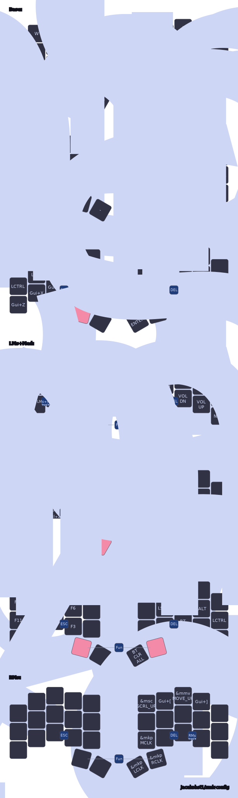

# 34-Key Layout using ZMK

| [🦀 Ferris Sweep](https://github.com/davidphilipbarr/Sweep) | [🪸 Urchin](https://github.com/duckyb/urchin) | [Forager](https://github.com/carrefinho/forager) |
|-------------------------------------------------------------|--------------------------------------------------|--------------------------------------------------|
|  |  |  |

This is my personal [ZMK](https://zmk.dev/) keymap shared across three different 34-key keyboards. It’s drawn using [keymap-drawer](https://github.com/caksoylar/keymap-drawer) and includes configurations for both dongle-based and dongleless setups.

## Firmware Builds

Keyboards support two connection styles:

### Dongle Setup

- `<keyboard_name>_dongle` → Flash to the dongle  
- `<keyboard_name>_left_peripheral` → Flash to the left half  
- `<keyboard_name>_right` → Flash to the right half  

### Dongleless Setup

- `<keyboard_name>_left_central` → Flash to the left half (acting as central)  
- `<keyboard_name>_right` → Flash to the right half  

---

## Layout Philosophy

- The layout loosely follows QWERTY conventions — for example, the top row still houses numbers and common symbols.
- With only 34 keys, space is tight. I prioritize frequently used characters and modifiers close to the home row and thumbs (e.g., `[]{}_-|:`, space, backspace, control, tab).
- Combos are used sparingly and intentionally to avoid accidental activations.

---

## Key Features

- **Home-row mods** inspired by [urob’s timeless layout](https://github.com/urob/zmk-config)  
  - Tuned **hold-tap behavior** for reliable mod/tap distinction
- **Combos** for essentials like:
  - Enter, Escape  
  - Cut / Copy / Paste  
  - Mouse toggle  
- **Multi-layer design**:
  - `BASE`: Standard QWERTY with mod-taps  
  - `SYMBOL`: Symbols and punctuation (top-row behavior)  
  - `NAVIGATION_NUMBER`: Vim-style navigation and number row  
  - `MSE`: Mouse keys and pointer control  
  - `FUNC`: Function keys, Bluetooth, keeb settings
---

## Layer Map

---

## Credits

- [urob/zmk-config](https://github.com/urob/zmk-config) — for home-row mod philosophy and layout ideas  
- [caksoylar/zmk-config](https://github.com/caksoylar/zmk-config) — for layout structure, code inspiration, and keymap-drawer integration  
